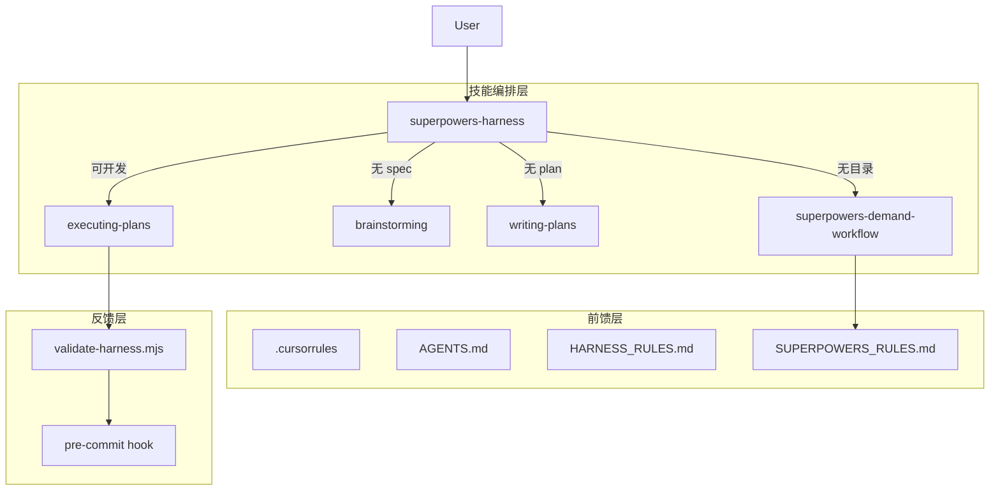

# Superpowers Harness 门禁体系 — 开发规格

**Requirement:** [requirements/01-原始需求.md](../requirements/01-原始需求.md)

## 1. 概述

在现有 `superpowers-demand-workflow`（文档落位引擎）之上叠加 **Harness 层**（流程门禁 + 机械校验 + 迁移打包），形成完整的 Agent 开发 Harness 体系。

| 层 | 技能/组件 | 职责 |
|----|-----------|------|
| 文档落位 | `superpowers-demand-workflow` | 目录结构、create-demand、bootstrap、spec/plan 路径规范 |
| 流程门禁 | `superpowers-harness`（新建） | 阶段判断、阻止跳过流程、技能编排 |
| 内容生成 | brainstorming / writing-plans / executing-plans | 写 spec/plan、执行开发 |
| 机械校验 | `validate-harness.mjs` | 将文档规范变为可执行检查 |

**核心原则**：demand-workflow 管「写到哪里」；harness 管「能不能写代码」和「怎么装到其他项目」。

## 2. 分阶段实施

| 阶段 | 目标 | 交付物 | 对应痛点 |
|------|------|--------|----------|
| **Phase 1**（本期） | 防跳过流程 | workflow-gate 校验器、HARNESS_RULES、AGENTS.md、bootstrap-harness、编排 skill | A |
| **Phase 2** | 防写错位置 + 标准模式 | doc-structure 强化、`--strict` 模式、CI 集成、fix 豁免规则 | B |
| **Phase 3** | 质量 + 迁移优化 | spec-quality 校验器、manifest 配置、skill eval | C、D |

## 3. Phase 1 门禁模式：宽松

| 场景 | Agent 层（技能指令） | 机械层（validate-harness） | Git hook |
|------|---------------------|---------------------------|----------|
| 无模块目录就改 `src/` | 强制走 create-demand | ⚠️ 警告 | 不阻断 commit |
| 无 spec/plan 就改 `src/` | 强制走 brainstorming/plans | ⚠️ 警告 | 不阻断 commit |
| 写入旧扁平路径 | 禁止 | ⚠️ 警告 | 不阻断 commit |
| spec/plan 缺头部链接 | 提示补全 | ⚠️ 警告 | 不阻断 commit |

```bash
# 宽松（默认，Phase 1）
node scripts/validate-harness.mjs          # 有违规 → 打印警告，exit 0

# 标准（Phase 2 启用）
node scripts/validate-harness.mjs --strict # 有违规 → exit 1
```

## 4. 架构



## 5. 数据流

### 5.1 阶段判断

```
输入：用户任务描述 + 可选文件路径

扫描 docs/superpowers/current/{type}/*/ 下所有模块

匹配优先级：
1. 用户明确指定模块名 → 精确匹配
2. 用户给出 src/ 路径 → 按路径片段 fuzzy 匹配模块名
3. 无法匹配 → 视为新需求，从 create-demand 开始

阶段枚举：
  NO_MODULE     → 调用 superpowers-demand-workflow (create-demand)
  NO_SPEC       → 调用 brainstorming
  NO_PLAN       → 调用 writing-plans
  READY_TO_DEV  → 允许修改 src/
```

### 5.2 技能调用链

| 阶段 | 调用技能 |
|------|----------|
| 入口判断 | `superpowers-harness` |
| 建目录 | `superpowers-demand-workflow` |
| 写 spec | `brainstorming` |
| 写 plan | `writing-plans` |
| 执行开发 | `executing-plans` 或按 plan 直接开发 |

### 5.3 提交流程

```
开发完成 → git add → pre-commit 触发 validate-harness.mjs
  → 有 warnings → 打印修复指引 + 写入 .harness/warnings.log → exit 0
  → 无 warnings → exit 0 → commit 成功
```

## 6. 文件清单

### 6.1 新建：`.agents/skills/superpowers-harness/`

```
superpowers-harness/
├── SKILL.md
├── references/
│   ├── HARNESS_RULES.md
│   └── AGENTS.md.template
├── scripts/
│   ├── bootstrap-harness.ps1
│   ├── bootstrap-harness.sh
│   └── validate-harness.mjs
└── validators/
    ├── index.js
    ├── workflow-gate.js
    └── doc-structure.js
```

### 6.2 Bootstrap 生成到项目

| 文件 | 来源 |
|------|------|
| `scripts/validate-harness.mjs` | 从 skill 复制 |
| `docs/superpowers/HARNESS_RULES.md` | 从 skill references 复制 |
| `AGENTS.md` | 从 template 生成（填充技术栈） |
| `.cursorrules` Harness 片段 | 追加合并，已存在则跳过 |
| `.agents/skills/superpowers-harness/` | 复制 skill 包 |
| `.cursor/skills/superpowers-harness/` | 从 .agents 同步 |

### 6.3 对现有文件的最小改动

| 文件 | 改动 |
|------|------|
| `superpowers-demand-workflow/SKILL.md` | 新增「与 Harness 衔接」一节 |
| `.cursorrules` | 追加：开发任务先读 `HARNESS_RULES.md` |
| `package.json` | `simple-git-hooks.pre-commit` 追加 validate（不 fail） |

## 7. 校验器规则

### 7.1 workflow-gate.js

| 检查项 | 条件 | 错误码 |
|--------|------|--------|
| 无活跃 plan | `src/` 有 staged 改动，且 current/ 下无任何模块同时含 spec + plan | `WORKFLOW_GATE_NO_PLAN` |
| 无模块 | `src/` 有 staged 改动，且 current/ 下无任何模块 | `WORKFLOW_GATE_NO_MODULE` |

### 7.2 doc-structure.js

| 检查项 | 条件 | 错误码 |
|--------|------|--------|
| 禁止路径 | 新文件在 `docs/superpowers/specs/`、`plans/`、`archive/`、`reports/`（无版本号层） | `DOC_LEGACY_PATH` |
| spec 头部 | 缺 `**Requirement:**` 链接 | `DOC_MISSING_REQUIREMENT_LINK` |
| plan 头部 | 缺 `**Spec:**` 链接 | `DOC_MISSING_SPEC_LINK` |
| 链接断裂 | 头部链接目标文件不存在 | `DOC_BROKEN_LINK` |
| 目录不全 | 模块缺 requirements/specs/plans/archive 之一 | `DOC_INCOMPLETE_DIRS` |

校验规则引用 `SUPERPOWERS_RULES.md`，不重复定义路径约定。

## 8. 错误处理

### 8.1 警告输出格式

```
⚠️  [HARNESS:WORKFLOW_GATE_NO_PLAN]
    src/ 有 3 个文件改动，但 superpowers 下找不到活跃的 spec/plan。

    修复步骤：
    1. scripts\create-demand.bat --type ui-style --name "你的模块名"
    2. 执行 /brainstorming 写 specs/01-dev-spec.md
    3. 执行 /writing-plans 写 plans/01-dev-plan.md

    模式：宽松（不阻断提交）。自查：node scripts/validate-harness.mjs
```

### 8.2 日志

路径：`.harness/warnings.log`（追加写入，加入 `.gitignore`）

```json
{
  "timestamp": "2026-07-09T14:30:00+08:00",
  "mode": "loose",
  "warnings": [
    { "code": "WORKFLOW_GATE_NO_PLAN", "files": ["src/pages/..."] }
  ],
  "exitCode": 0
}
```

### 8.3 升级路径

```
Phase 1: 默认 loose，积累 warnings.log
    ↓
Phase 2: --strict 切换；fix 类型可配置豁免（有 spec、改动 < 50 行、无 plan 时不警告）
    ↓
Phase 3: pre-commit 默认 strict
```

## 9. bootstrap-harness 流程

```
Step 1: 调用 superpowers-demand-workflow 的 bootstrap.ps1/sh（已有逻辑）
Step 2: 复制 validate-harness.mjs → 项目 scripts/
Step 3: 复制 HARNESS_RULES.md → docs/superpowers/
Step 4: 从 AGENTS.md.template 生成 AGENTS.md
Step 5: 合并 .cursorrules 片段（幂等，不重复追加）
Step 6: 复制 superpowers-harness skill → .agents/skills/ + .cursor/skills/
Step 7: 更新 package.json simple-git-hooks（追加 validate，宽松不 fail）
Step 8: 将 .harness/ 加入 .gitignore
Step 9: 打印安装报告
```

## 10. HARNESS_RULES.md 要点

- 叠加 `SUPERPOWERS_RULES.md`，不替代
- 开发类任务前须同时读取两份规则
- 阶段门禁推荐顺序：create-demand → brainstorming → writing-plans → 开发
- 技能调用顺序表（harness → demand-workflow → brainstorming → writing-plans → executing-plans）
- 注明当前为宽松模式及升级路径

## 11. AGENTS.md.template 要点

bootstrap 时填充：

| 占位符 | 示例 |
|--------|------|
| `{{FRAMEWORK}}` | Vue 3 + Vite + TypeScript |
| `{{UI_LIB}}` | Element Plus |
| `{{STATE}}` | Pinia |

固定内容：目录导航表、开发流程四步、禁止事项（旧路径、跳过流程）。

## 12. superpowers-harness/SKILL.md 要点

**触发词**：新功能、改页面、修 bug、开发、实现等开发类意图。

**description** 须包含：Harness 门禁、阶段判断、与 superpowers-demand-workflow 衔接、bootstrap 迁移。描述略「主动」以提高触发率。

**核心指令**：
1. 读取 HARNESS_RULES + SUPERPOWERS_RULES
2. 判断阶段，路由到对应技能
3. 未 READY_TO_DEV 时不得引导修改 src/（宽松模式下用户坚持则警告后继续）
4. commit 前提示运行 validate-harness 自查

## 13. 测试

### 13.1 单元测试

```
validators/__tests__/
├── workflow-gate.test.js
└── doc-structure.test.js
```

| 用例 | 期望 |
|------|------|
| 无 src 改动 | 0 warnings |
| src 改动 + 有 plan | 0 warnings |
| src 改动 + 无 plan | `WORKFLOW_GATE_NO_PLAN` |
| 写入 legacy 路径 | `DOC_LEGACY_PATH` |
| spec 缺 Requirement 链接 | `DOC_MISSING_REQUIREMENT_LINK` |
| loose 模式有 warnings | exit 0 |
| strict 模式有 warnings | exit 1 |

### 13.2 集成测试

| 用例 | 期望 |
|------|------|
| 空目录 bootstrap-harness | 全部文件生成，create-demand 可用 |
| 已有 superpowers 再 bootstrap | 不覆盖已有文件，只追加 |
| .cursorrules 已存在 | 追加片段不重复 |
| skill 同步 | .agents 与 .cursor 各有一份 |

### 13.3 手工验收

- [ ] 说「做个新页面」→ harness 引导 create-demand，不直接写 src/
- [ ] 有 plan 后开发 → pre-commit 无警告
- [ ] 跳过流程直接改 src/ → pre-commit 打印警告但 commit 成功
- [ ] 写入 `docs/superpowers/specs/` → 警告提示正确路径
- [ ] bootstrap 到临时目录 → 全流程可走通
- [ ] `validate-harness.mjs --strict` → 有违规时 exit 1

## 14. 不在本期范围

- `--strict` 作为默认模式（Phase 2）
- CI pipeline 集成（Phase 2）
- legacy 路径存量清理工具（Phase 2）
- spec 内容质量检查（Phase 3）
- 多项目 manifest 配置（Phase 3）
- skill eval 基准测试（Phase 3）
- AGENTS.md 从代码结构自动生成（Phase 3）

## 15. 验收标准

Phase 1 完成当且仅当：

1. `.agents/skills/superpowers-harness/` 技能包完整可用
2. `bootstrap-harness` 可在本项目和空目录成功安装
3. `validate-harness.mjs` 覆盖 workflow-gate 与 doc-structure 全部规则
4. 宽松模式下 warnings 正确输出、exit 0，strict 模式 exit 1
5. `superpowers-demand-workflow` 新增 Harness 衔接说明
6. 单元测试全部通过
7. 手工验收清单全部勾选
